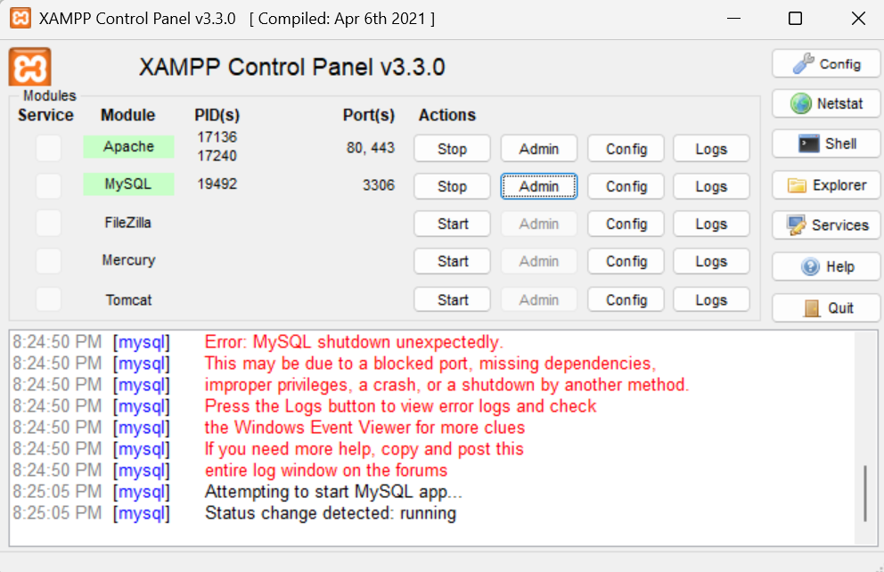
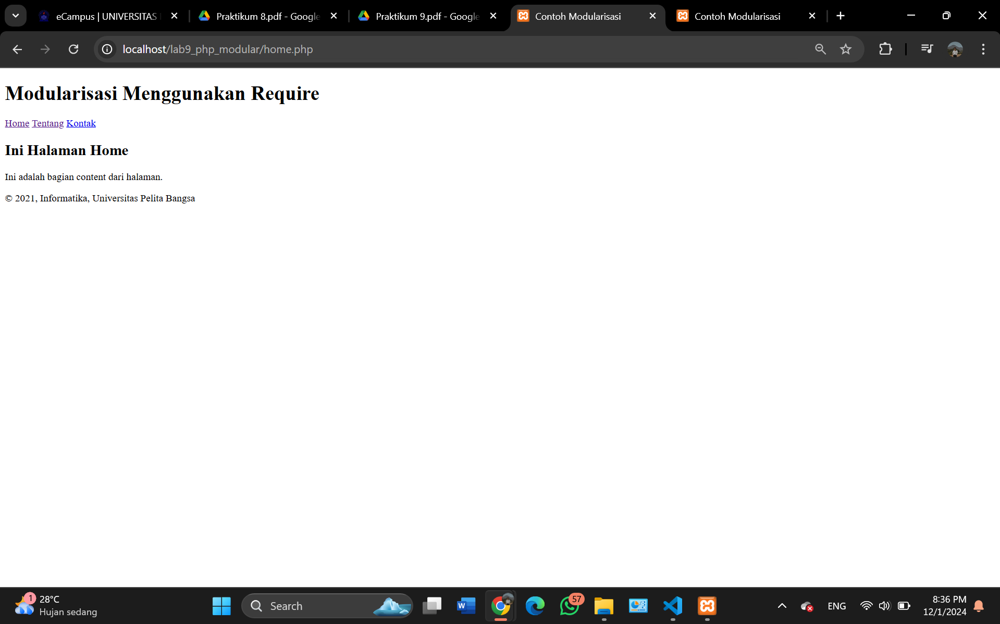
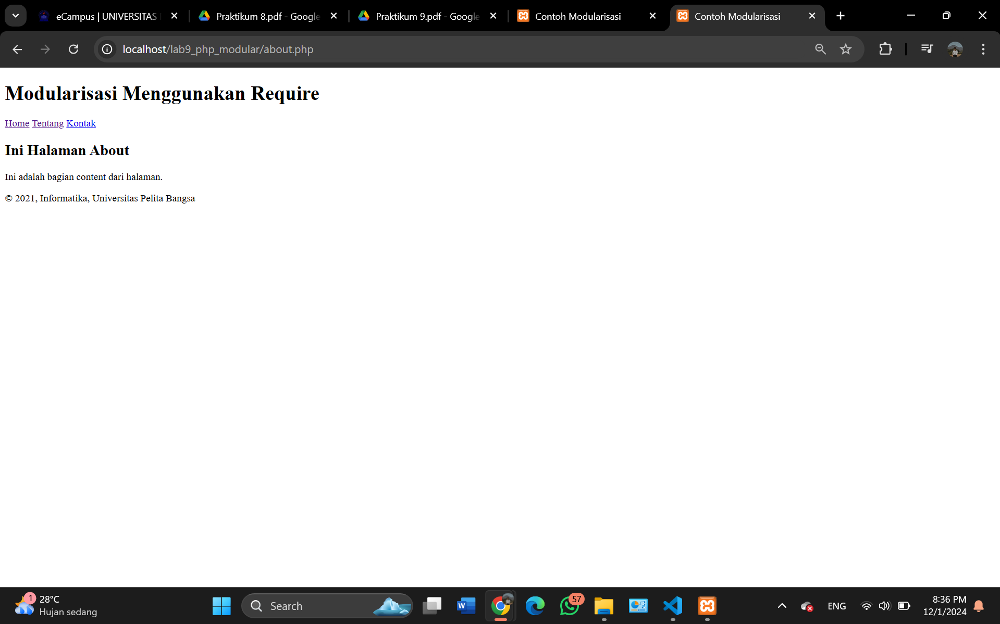
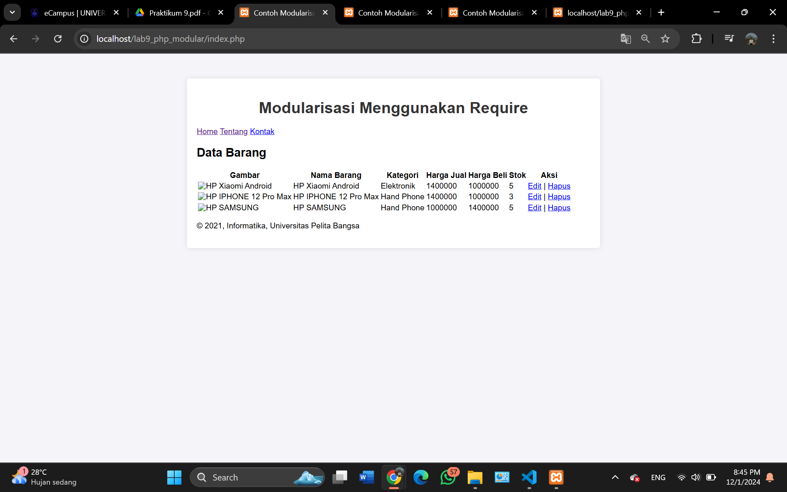
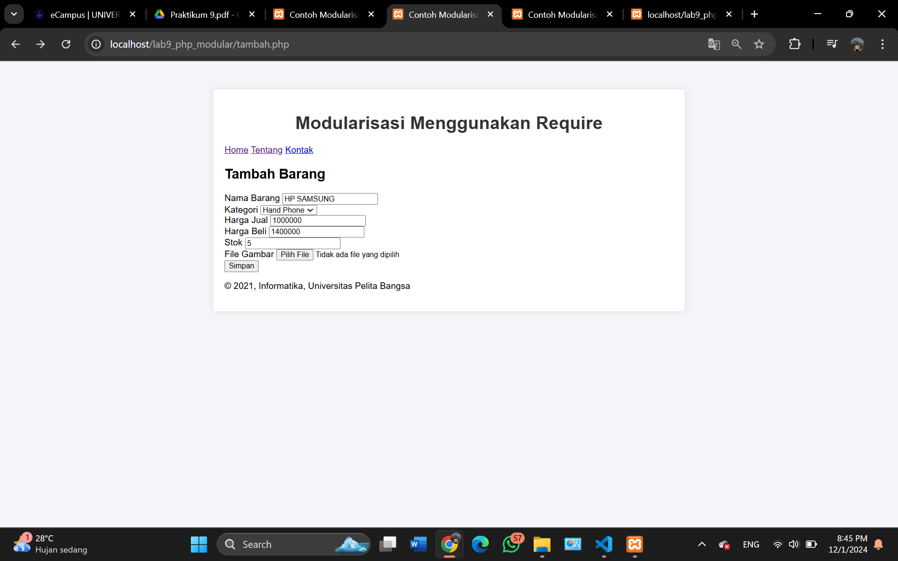
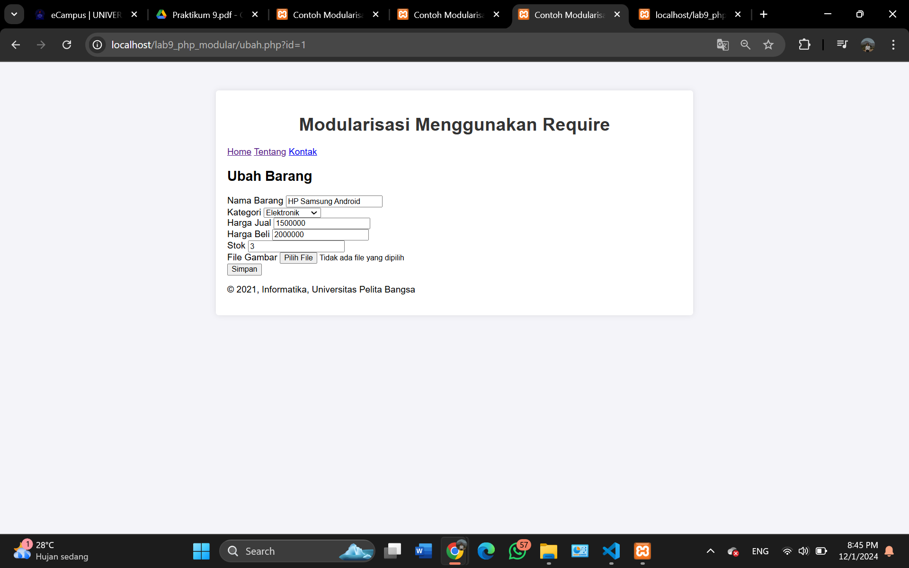
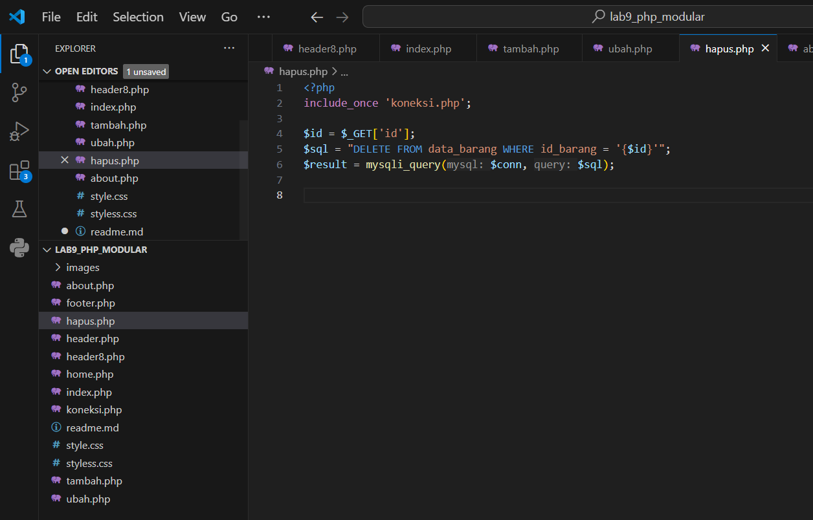

# Tugas Praktikum Pemrograman Web

#### Menjalankan Web Server

# 

#### 1. Tampilan Halaman Home.php

# 

#### 2. Tampilan Halaman About.php

# 

## Pertanyaan dan Tugas
Implementasikan konsep modularisasi pada kode program praktikum 8 tentang
database, sehingga setiap halamannya memiliki template tampilan yang sama.

####  Halaman Utama (index.php) seperti pada praktikum 8

# 

#### Untuk Menambah Data (tambah.php)

# 

#### Untuk Mengedit Data (ubah.php)

# 

#### Code Untuk Menghapus Data dengan Id (hapus.php)

# 